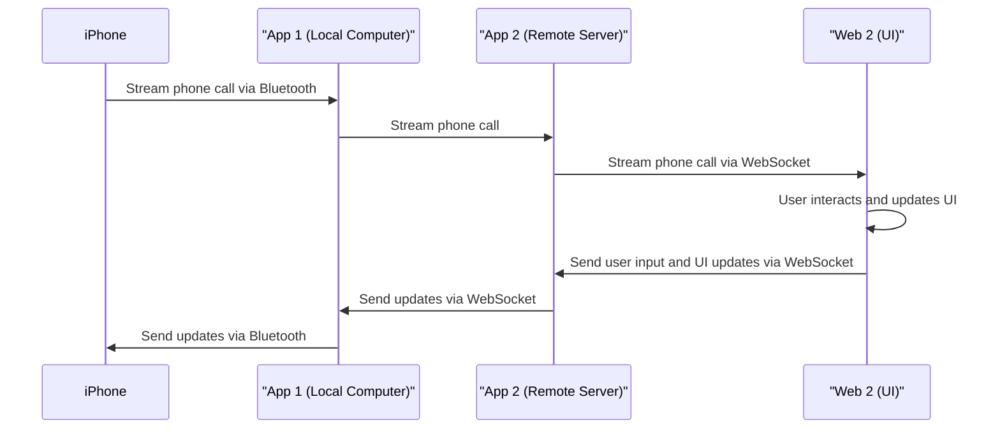

# Gesture: WebSocket to Bluetooth LE Bridge in Go

Gesture is a Go application that establishes a bridge between a WebSocket server and a Bluetooth Low Energy (BLE) device. In this particular use case, we are connecting to an iPhone over Bluetooth and then enabling communication over WebSockets.

## Overview

1. **Bluetooth Low Energy (BLE) Communication**: Gesture establishes a connection with an iPhone using Bluetooth Low Energy. This low-power wireless protocol is ideal for devices that need to periodically transfer data over short distances.
    
2. **WebSocket Server**: Gesture also sets up a WebSocket server, which allows for full-duplex communication channels over a single TCP connection.
    
3. **Bridge Between BLE and WebSocket**: The core functionality of Gesture is to relay the data between the iPhone (via BLE) and the WebSocket server. This enables data to flow seamlessly between these two channels.
    

## Working Mechanism

1. **Start the Application**: When we start the Gesture application, it begins scanning for available BLE devices.
    
2. **Connect to iPhone via BLE**: The application identifies an iPhone by its service UUID. Once identified, it establishes a BLE connection with the iPhone.
    
3. **Setup WebSocket Server**: Alongside the BLE setup, Gesture also initiates a WebSocket server that listens on a designated port.
    
4. **Data Transfer**: Now, any data received from the iPhone over BLE can be transferred to any connected WebSocket client. Similarly, data received from the WebSocket server can be sent to the iPhone over BLE.
    

## How to Use

1. **Start Gesture**: Run the Gesture application on your system. Make sure your system's Bluetooth is turned on and the iPhone's Bluetooth is discoverable.
    
2. **Connect WebSocket Client**: Connect any WebSocket client to the WebSocket server running in Gesture. The server listens on the port specified in the server configuration.
    
3. **Bi-directional Data Flow**: Once both connections are established, you can start sending data from the iPhone to the WebSocket client and vice versa.
    

Please note that the actual communication protocols, data formats, etc., might depend on the specific implementation and application requirements.

The Gesture application provides a simple, effective, and efficient way to connect a WebSocket server with a BLE device. Its modular design allows it to be easily integrated into larger systems or used standalone for a variety of use cases. Enjoy exploring its possibilities!
