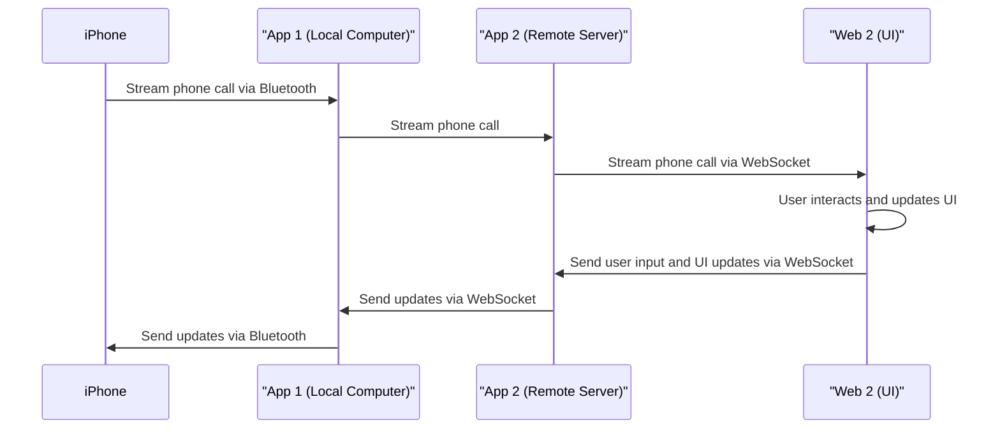

```mermaid
sequenceDiagram
    participant iPhone
    participant App1 as "App 1 (Local Computer)"
    participant App2 as "App 2 (Remote Server)"
    participant Web2 as "Web 2 (UI)"

    iPhone->>App1: Stream phone call via Bluetooth
    App1->>App2: Stream phone call
    App2->>Web2: Stream phone call via WebSocket
    Web2->>Web2: User interacts and updates UI
    Web2->>App2: Send user input and UI updates via WebSocket
    App2->>App1: Send updates via WebSocket
    App1->>iPhone: Send updates via Bluetooth
```

